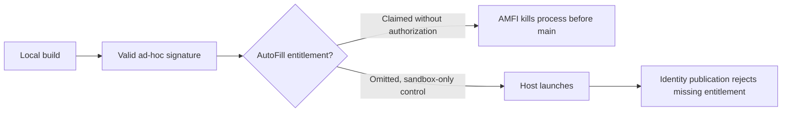
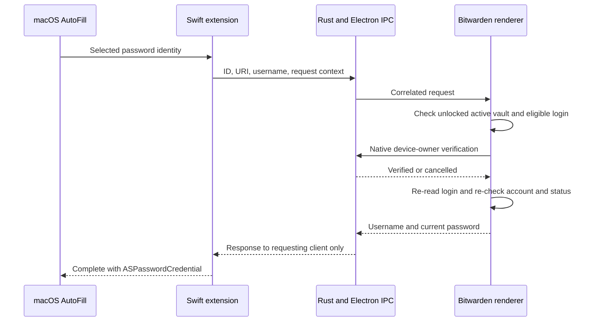

# Native macOS password AutoFill: approach and findings

This fork adds the missing **selected-password request path** to Bitwarden's existing
macOS credential-provider extension. The code builds and focused tests pass. It is
**not yet a working, end-to-end verified system AutoFill installation**. The local
ad-hoc provider never became selectable. A controlled minimal experiment isolates
an OS signing block: adding only the AutoFill entitlement makes macOS kill the
test process before it reaches `main`.

Research and local checks were performed September 30–October 1, 2026, against this fork's
Bitwarden desktop 2026.9.1 source. The test machine runs arm64 macOS 27.0.1 and has
Command Line Tools, but no full Xcode, paid developer membership, signing identity,
or provisioning profile.

## What macOS actually needs

There are four distinct pieces:

1. The desktop app owns and decrypts the vault.
2. An `ASCredentialIdentityStore` publishes suggestion metadata: website, username,
   and an opaque record ID. Passwords are not part of this suggestion index.
3. A separate `.appex` credential provider handles a selected suggestion and returns
   an `ASPasswordCredential` to macOS.
4. macOS must accept the extension's signing and capabilities, and the user must
   enable the provider in **System Settings → General → AutoFill & Passwords**.

An Electron app alone cannot become a system provider. A browser extension and
desktop Auto-Type are separate integrations. Native AutoFill works where the host
app supports Apple's credential APIs; it is not arbitrary typing into every app.
[Apple's provider API](https://developer.apple.com/documentation/authenticationservices/ascredentialproviderviewcontroller)
defines the password request and completion lifecycle.

Apple lists AutoFill credential provider support for paid Apple Developer Program
and Developer ID signing, but not the free Apple Developer account column in its
[macOS capability matrix](https://developer.apple.com/help/account/reference/supported-capabilities-macos).
The supported signing route therefore needs a paid developer team even for this
local capability; choosing not to distribute does not grant the entitlement. This
need not be the user's own membership if another authorized team signs the fork
with its own identifiers and appropriate provisioning. Membership
is [99 USD per year, or local currency where available](https://developer.apple.com/help/account/membership/program-enrollment),
not a one-time purchase. Xcode itself is free.

Ad-hoc signing writes a local signature and can embed entitlement claims. It does
not establish Apple's authorization for a restricted capability. Apple's
[TN3125](https://developer.apple.com/documentation/technotes/tn3125-inside-code-signing-provisioning-profiles)
explains the distinction between claims and authorization: a provisioning profile
is cryptographically signed by Apple and constrains the signer, app, devices,
validity period, and entitlements. Locally inventing that profile or copying a
profile without its authorized signing key does not authorize a modified fork.
Ordinary sandbox and debugger entitlements are unrestricted on macOS; AutoFill
is a separate capability. Apple requires its entitlement on
[both the host and extension](https://developer.apple.com/documentation/bundleresources/entitlements/com.apple.developer.authentication-services.autofill-credential-provider).

### Why a free Personal Team does not resolve step 4

Apple calls an Xcode account without program membership a
[Personal Team](https://developer.apple.com/help/account/basics/about-your-developer-account).
Free local development signing is different from the ad-hoc signature tested
below. However, Apple's current macOS capability matrix does not support AutoFill
in its free-account column. Changing bundle IDs and selecting a Personal Team
does not change that capability eligibility. Enabling the capability must produce
authorization for both targets, not only an entitlement claim in their signatures.
The exact Xcode Personal Team workflow was **not tested** here because full Xcode
is absent; its eligibility conclusion comes from Apple's documentation.

[`ASSettingsHelper.requestToTurnOnCredentialProviderExtension`](<https://developer.apple.com/documentation/authenticationservices/assettingshelper/requesttoturnoncredentialproviderextension(completionhandler:)>)
requests the user's activation of a contained provider. It does not issue the
signing authorization missing at the preceding step. The synthetic probe's false
activation result is an observation about that ad-hoc installation, not a direct
test of a Personal Team provisioning attempt.

## Can local signing bypass this?

**No membership-free route was demonstrated with this Mac's security protections
unchanged.** A bypass on a modified OS is plausible, but that is a different claim
from ad-hoc signing being sufficient for a local app.



### Controlled launch test

The same tiny Swift program (`print("Reached main")`) was placed in four complete
app bundles and ad-hoc signed with different entitlement sets. All four passed
`codesign --verify --strict`; execution used the binary inside its signed bundle.

| Claims added to an ad-hoc signature             | Signature verification | Execution on macOS 27.0.1     |
| ----------------------------------------------- | ---------------------- | ----------------------------- |
| Sandbox only                                    | Pass                   | Prints `Reached main`; exit 0 |
| Sandbox + AutoFill only, no fake team or App ID | Pass                   | SIGKILL before `main`         |
| Sandbox + invented team and App ID, no AutoFill | Pass                   | SIGKILL before `main`         |
| Sandbox + AutoFill + invented team and App ID   | Pass                   | SIGKILL before `main`         |

For the AutoFill-only variant, `amfid` reported
`AppleMobileFileIntegrityError Code=-424`:

> The file is adhoc signed but contains restricted entitlements

This isolates AutoFill itself from the fake identifiers, nib resources, Bitwarden,
and vault IPC. Launching that diagnostic under LLDB also failed, with the same
AMFI error in the log. This was an ordinary debugger launch of our own program,
not an attempt to patch the system signing daemon.

A separate programmatic host and credential-provider extension removed the nib
dependency and used only a fixed fake login. Claiming AutoFill in its ad-hoc host
also failed at launch with `-424`. After removing the host's restricted claims,
computer use verified these controls:

| Synthetic host operation                                      | Observed result                                                                                |
| ------------------------------------------------------------- | ---------------------------------------------------------------------------------------------- |
| Launch                                                        | Window opens                                                                                   |
| Read identity store state                                     | `enabled: false`                                                                               |
| `ASSettingsHelper.requestToTurnOnCredentialProviderExtension` | `false`                                                                                        |
| Save a synthetic password identity                            | `ASCredentialIdentityStoreErrorDomain`, code 0; calling process lacks the AutoFill entitlement |

A fresh complete `AutoFill Signature Probe.app` repeated the check with **both
host and extension** claiming only sandbox and AutoFill, without invented team or
application-identifier entitlements. Both signatures were ad-hoc and passed
`codesign --verify --deep --strict`. The user launched this copy through `open`;
it failed with `RBSRequestErrorDomain` code 5 and underlying POSIX error 163.
At 01:32:55 on October 1, `amfid` logged the host's exact path with the same
restricted-entitlement error `-424`. `AuthenticationServicesAgent` also discovered
its extension. Discovery and entitlement presence therefore succeeded, while
host launch authorization failed. This was a user launch, not a computer-use
launch: the automation tool denied access to this new app identity.

The [activation helper](https://developer.apple.com/documentation/authenticationservices/assettingshelper)
does not provide a signing override. `codesign` validity, plug-in registration,
Gatekeeper approval, and capability authorization are distinct checks;
[TN2206](https://developer.apple.com/library/archive/technotes/tn2206/_index.html)
describes the differing trust policies used by macOS subsystems. Changing a
Gatekeeper setting would not address the entitlement failure isolated here.

### Deeper bypass projects: research leads, not an AutoFill solution

| Primary source                                                                                      | What its authors demonstrate or claim                                                                                                                                                                                              | Remaining gap                                                                                                                                                          |
| --------------------------------------------------------------------------------------------------- | ---------------------------------------------------------------------------------------------------------------------------------------------------------------------------------------------------------------------------------- | ---------------------------------------------------------------------------------------------------------------------------------------------------------------------- |
| [`amfi-allow`](https://github.com/Lakr233/amfi-allow/tree/aabe81d621f0824fd3247e13201a0700a9cffb8e) | Per-code-hash entitlement allowance on Apple Silicon macOS 26/27, requiring root and relaxed SIP debugging restrictions. Its source writes an `amfid` heap flag and a gated preference; it avoids executable-instruction patching. | Its reported workload uses private virtualization entitlements, not AutoFill. It does not establish provider discovery, activation, or successful password completion. |
| [`amfree`](https://github.com/retX0/amfree)                                                         | Userspace `amfid` validation hooking, also requiring root and relaxed SIP debugging restrictions.                                                                                                                                  | Its README explicitly excludes kernel AMFI restrictions. No working AutoFill provider is demonstrated.                                                                 |

These sources make it inaccurate to say every local bypass is impossible.
They also do not prove this fork can fill passwords using one. Rebuilds, daemon
restarts, cached verdicts, and independent capability checks remain considerations.
Neither tool was installed or run; SIP remained enabled, as the user requested.
An older [fake-certificate CoreTrust proof of concept](https://worthdoingbadly.com/coretrust/)
did work with SIP enabled on macOS 12.3.1, but its author reproduced rejection on
12.4 and attributes the change to the patched certificate-validation bug
[`CVE-2022-26766`](https://support.apple.com/en-ca/102871), also listed in Apple's
12.4 security notes. That historical exploit is not evidence of a working route on
this macOS 27.0.1 machine. No current SIP-preserving AutoFill signing bypass was
verified in this research.

Reusing the installed Bitwarden app was also checked without modifying it:
`/Applications/Bitwarden.app` contains a Safari extension, no native credential
provider, and neither an AutoFill nor a `get-task-allow` entitlement. It cannot
supply an already authorized native provider for this patch. Apple's
[debugger entitlement documentation](https://developer.apple.com/documentation/bundleresources/entitlements/com.apple.security.cs.debugger)
also requires the target's debugger permission; no runtime attachment was tried.
A separately signed provider deliberately designed to accept external data/code
is conceivable, but no compatible implementation was verified.

The practical supported alternative is a correctly signed/provisioned build from
an authorized developer team. Having somebody else sign it does not require the
end user to buy their own membership, but the fork's packaging still needs its own
identifiers and a real native AutoFill test.

### Third-party signing services

These are research leads, not verified AutoFill solutions. Directory searches
returned no matches; the findings below come from providers' own documentation.

| Provider                                                                              | Documented offer                                                                                                   | Gap for this fork                                                                                                                                                                                                            |
| ------------------------------------------------------------------------------------- | ------------------------------------------------------------------------------------------------------------------ | ---------------------------------------------------------------------------------------------------------------------------------------------------------------------------------------------------------------------------- |
| [Seal Your App](https://sealyour.app/)                                                | Advertises macOS signing/notarization without customer developer accounts, from $5 per seal; CLI/API is $25/month. | Public pages show a waitlist. Its [API](https://sealyour.app/docs/api) does not document `.appex` handling, custom entitlements or AutoFill provisioning profiles. Availability and capability support require confirmation. |
| [ToDesktop](https://www.todesktop.com/electron/docs/introduction/signing-application) | Cloud signing of Electron apps.                                                                                    | Requires the customer's Apple signing certificate; does not document supplying the missing signing authority.                                                                                                                |
| [SignPath](https://docs.signpath.io/crypto-providers/macos)                           | Remote certificate/key access through macOS CryptoTokenKit.                                                        | Requires an appropriate Apple certificate. Its free OSS program was not verified as a source of Apple AutoFill authorization.                                                                                                |

The useful service test is a signed **synthetic provider first**: both host and
extension need Apple-authorized AutoFill entitlements, matching identifiers and
profiles under the signing team. The full fork additionally needs matching App
Groups. Verify launch, Settings activation and fake-password filling with SIP
enabled before treating a service's ordinary signing/notarization offer as a
solution. No service account, upload, payment or external message was made.

## Existing implementations and why this gap exists

| Source                                                                             | Finding                                                                                                                                                                                                                       | Effect on this approach                                                                            |
| ---------------------------------------------------------------------------------- | ----------------------------------------------------------------------------------------------------------------------------------------------------------------------------------------------------------------------------- | -------------------------------------------------------------------------------------------------- |
| This checkout's `apps/desktop/src/autofill` and `apps/desktop/macos`               | Password identity sync exists, while Swift request handlers primarily implement passkeys.                                                                                                                                     | Extend the existing bridge instead of adding another vault or IPC system.                          |
| This checkout's `scripts/after-pack.js`                                            | Packaging includes the native AutoFill extension only for `mas-dev`; its comment cites provisioning-profile entitlements.                                                                                                     | A normal packaged desktop app does not gain native AutoFill just from this code change.            |
| [Bitwarden discussion #21537](https://github.com/orgs/bitwarden/discussions/21537) | A contributor describes the password request-handler gap and proposes adding it.                                                                                                                                              | Corroborates the source inspection; it is not an official release commitment.                      |
| [VaultGuard](https://github.com/kruatech/VaultGuard)                               | A separate native client for self-hosted Bitwarden-compatible vaults has a credential provider, interactive selection/unlock, and password completion. Its build instructions require paid membership for these capabilities. | Useful API and lifecycle reference. This patch does not copy its vault/cache architecture or code. |
| [Prizm](https://github.com/b0x42/prizm)                                            | A separate Swift client; its README says copy/paste is the current workflow and browser AutoFill is on the roadmap.                                                                                                           | Does not establish an existing solution to this system-provider request.                           |

The searches found an existing compatible native client and an upstream proposal,
but no verified, maintained Bitwarden-clients fork delivering this feature with a
membership-free macOS installation. That is a scoped research result, not a claim
that no private or unindexed implementation exists.

## Minimal implementation



The extension advertises `ProvidesPasswords`. Both the legacy password-identity
callback and the modern `ASPasswordCredentialRequest` callback use one helper.
Silent password requests return `userInteractionRequired`, so every successful
fill goes through native device-owner verification: Touch ID or the device's login
password, using Bitwarden's existing LocalAuthentication command.

The renderer captures the active account and requires an unlocked vault, an
enabled feature flag, a nondeleted/nonarchived login, no decryption failure, no
item master-password reprompt, and a nonempty username/password. The selected ID,
username, and first eligible URI must still agree. It reads the login again after
verification, checks account/status/flag/cancellation again, and returns the
current password. Stale identities fail instead of selecting a different login.

This reuses the existing metadata representation: one first eligible URI per
login. It does not replace Bitwarden's matching engine or offer all login URIs.
Items requiring a master-password reprompt are excluded rather than bypassed.

The Swift request context is set before the first async connection attempt.
Dismissal, disconnection, and a 60-second timeout invalidate the request and
cancel the desktop work. Main-queue terminal callbacks accept only the matching
active context; late callbacks cannot complete a dismissed request.

Native completions now use the existing per-client sender instead of broadcasting
responses to every connected extension client. The password response does not
derive Rust `Debug`, and deserialization errors do not print raw IPC payloads.
Passwords are returned in memory through the existing local IPC, not stored in a
new extension database. This is not a redesign of the existing local IPC trust
model, nor a guarantee of memory zeroization.

The native module also now links AuthenticationServices and LocalAuthentication
explicitly. A real macOS load test found an unresolved `ASCredentialIdentityStore`
symbol without those existing Objective-C dependencies linked.

## Supported scope and deliberate omissions

| Behavior                                                    | This patch                                                                    |
| ----------------------------------------------------------- | ----------------------------------------------------------------------------- |
| Fill an explicitly selected system password suggestion      | Implemented; OS end-to-end validation outstanding                             |
| Native device-owner authentication for each fill            | Required                                                                      |
| Vault already unlocked                                      | Required; unlock Bitwarden manually, then retry                               |
| Generic password chooser or search UI                       | Not implemented; list requests cancel                                         |
| Item master-password reprompt                               | Not supported; those items are excluded                                       |
| Multiple accounts                                           | Only the current active unlocked account                                      |
| Create, save, or update passwords                           | Not implemented                                                               |
| Verification codes, cards, identities, arbitrary app typing | Not implemented                                                               |
| Existing passkey functionality                              | Existing request handlers retained; no live passkey regression test performed |
| Firefox/Chrome browser extension replacement                | Not established; continue using their browser integrations                    |
| Turn on the feature for everyone                            | No; shared default remains off                                                |
| Paid membership or signing bypass                           | No working membership-free provider demonstrated with SIP unchanged           |

## Local validation and its limits

- **35 focused desktop Jest tests pass**, including success, invalid/stale identity,
  null/empty collections, locked/logged-out vaults, cancelled verification, account
  switch, feature disable, request cancellation, deletion, reprompt, and password
  update during verification. Array-shaped vault mocks match the real service.
- **3 existing Rust provider tests pass** with local Unix-socket access.
- **1 real compiled N-API integration test passes**: a second IPC client first
  acknowledges a status request, then receives no password response intended for
  the requesting client. Framing handles split socket reads.
- Desktop main, preload, and renderer development webpack builds pass. Existing
  Sass/compiler warnings remain. Targeted ESLint and diff-whitespace checks pass.
- Generated UniFFI Swift bindings and the modified extension typecheck against
  Apple's SDK with application-extension checking. The extension executable also
  links. Existing passkey capture warnings and local toolchain deployment-target
  warnings remain; this does not verify runtime compatibility with macOS 14.2.
- Computer use launched the built Electron fork in an isolated local data
  directory; the user signed in and the vault UI loaded. Its per-install native
  feature flag was enabled, followed by reload. Native status returned
  `support.password: true`, `support.fido2: true`, **`state.enabled: false`**.
  Signature/bundle inspection subsequently confirmed that this desktop-only
  launch copy has no host AutoFill entitlement and no embedded `.appex`. It is
  therefore a desktop startup/IPC smoke test, not a complete provider installation
  test; its disabled status alone does not establish a signing rejection. The
  separate complete synthetic bundles and controlled launch matrix test signing.
- A live request through the running desktop's native IPC rejected a nonexistent
  synthetic login with the expected unavailable-identity error. A separate native
  authentication smoke test returned **`outcome: verified`**, observed through
  computer use. Neither test requested a saved vault password.
- Earlier ad-hoc registration probes appeared in `pluginkit` but were absent from
  AutoFill & Passwords after reopening the page. Those experiments had packaging
  and process/cache confounds and did not isolate the rejection cause. The clean
  launch matrix and programmatic synthetic probe above provide stronger evidence;
  an earlier apparent host launch is not proof of accepted restricted claims.

**A real password fill from Safari or a native app has not been verified.** Do not
treat passing source tests or a plug-in registration as proof of that result.

## Reproducing the code checks

Use the repository's pinned Node version, Rust toolchain, and macOS SDK. Follow
[Bitwarden's desktop build instructions](https://contributing.bitwarden.com/getting-started/clients/desktop/)
for the normal dependency/native build setup. From the repository root:

```sh
npm run build:dev --workspace @bitwarden/desktop
npx jest --config apps/desktop/jest.config.js --runInBand \
  apps/desktop/src/autofill/services/desktop-autofill.service.spec.ts \
  apps/desktop/src/autofill/main/main-desktop-autofill.service.spec.ts
```

From `apps/desktop/desktop_native/napi`, build the debug native module and run the
isolated regression test (it requires permission to create Unix sockets):

```sh
npm run build -- --target=aarch64-apple-darwin
node --test tests/password-credential.test.cjs
```

From `apps/desktop/desktop_native`:

```sh
cargo test -p autofill_provider --features uniffi --lib
```

## What is needed for a real installation

Install full Xcode, obtain a developer team/signing identity with the AutoFill
capability, and produce a valid extension and containing app. The checked-in
Xcode and packaging scripts reference Bitwarden's signing identities and profiles;
these are not credentials this fork can use. A separately signed fork needs its
own bundle IDs, provisioning, and a consistent App Group across host, extension,
entitlements, and the Rust socket path. That packaging work is outside this
minimal request-handler patch.

For a correctly provisioned local app, the existing `mas-dev` build path includes
the extension. Enable this per-install override in the renderer DevTools console,
then reload the app:

```js
await bitwardenAutomationDriver.get("featureFlags").set("macos-native-credential-sync", true);
location.reload();
```

Enable the provider in macOS Settings, unlock the vault, let metadata sync, and
test a disposable login in Safari. Verify success after native authentication,
then cancel the prompt, lock/switch the vault during the prompt, and dismiss the
system UI. None of the rejected cases should fill. Retest existing passkeys with
the same signed package before treating the build as ready for daily use.

The remaining practical decision is whether to obtain the supported Apple
signing capability. The current local build demonstrates compilation, desktop
startup, and disabled native status; it does not meet the original goal of making
Bitwarden selectable as the Mac's system password provider.
