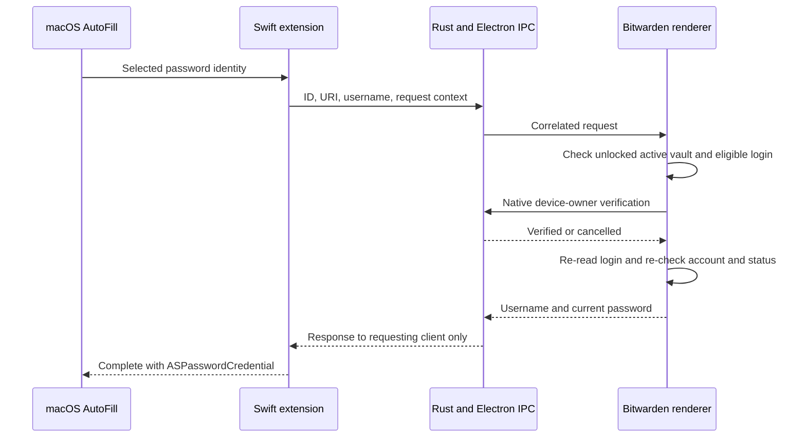

# Native macOS password AutoFill: approach and findings

This fork adds the missing **selected-password request path** to Bitwarden's existing
macOS credential-provider extension. The code builds and focused tests pass. It is
**not yet a working, end-to-end verified system AutoFill installation**: the local
ad-hoc provider did not appear in AutoFill & Passwords, and native status remained
`enabled: false`.

Research and local checks were performed September 30–October 1, 2026, against this fork's
Bitwarden desktop 2026.9.1 source. The test machine runs arm64 macOS 27.0.1 and has
Command Line Tools, but no full Xcode, paid developer membership, signing identity,
or provisioning profile.

## What macOS actually needs

There are four distinct pieces:

1. The desktop app owns and decrypts the vault.
2. An `ASCredentialIdentityStore` publishes suggestion metadata: website, username,
   and an opaque record ID. Passwords are not part of this suggestion index.
3. A separate `.appex` credential provider handles a selected suggestion and returns
   an `ASPasswordCredential` to macOS.
4. macOS must accept the extension's signing and capabilities, and the user must
   enable the provider in **System Settings → General → AutoFill & Passwords**.

An Electron app alone cannot become a system provider. A browser extension and
desktop Auto-Type are separate integrations. Native AutoFill works where the host
app supports Apple's credential APIs; it is not arbitrary typing into every app.
[Apple's provider API](https://developer.apple.com/documentation/authenticationservices/ascredentialproviderviewcontroller)
defines the password request and completion lifecycle.

Apple lists AutoFill credential provider support for paid Apple Developer Program
and Developer ID signing, but not the free Apple Developer account column in its
[macOS capability matrix](https://developer.apple.com/help/account/reference/supported-capabilities-macos).
The supported signing route therefore needs paid membership even for this local
capability; choosing not to distribute does not grant the entitlement. Membership
is [99 USD per year, or local currency where available](https://developer.apple.com/help/account/membership/program-enrollment),
not a one-time purchase. Xcode itself is free.

Ad-hoc signing writes a local signature and can embed entitlement claims. It does
not establish Apple's authorization for a restricted capability. The local probe
demonstrated that `codesign` and `pluginkit` success are insufficient evidence of
usable password AutoFill. This experiment did not prove an exact rejection cause
or that every conceivable unsupported local workaround is impossible.

## Existing implementations and why this gap exists

| Source                                                                             | Finding                                                                                                                                                                                                                       | Effect on this approach                                                                            |
| ---------------------------------------------------------------------------------- | ----------------------------------------------------------------------------------------------------------------------------------------------------------------------------------------------------------------------------- | -------------------------------------------------------------------------------------------------- |
| This checkout's `apps/desktop/src/autofill` and `apps/desktop/macos`               | Password identity sync exists, while Swift request handlers primarily implement passkeys.                                                                                                                                     | Extend the existing bridge instead of adding another vault or IPC system.                          |
| This checkout's `scripts/after-pack.js`                                            | Packaging includes the native AutoFill extension only for `mas-dev`; its comment cites provisioning-profile entitlements.                                                                                                     | A normal packaged desktop app does not gain native AutoFill just from this code change.            |
| [Bitwarden discussion #21537](https://github.com/orgs/bitwarden/discussions/21537) | A contributor describes the password request-handler gap and proposes adding it.                                                                                                                                              | Corroborates the source inspection; it is not an official release commitment.                      |
| [VaultGuard](https://github.com/kruatech/VaultGuard)                               | A separate native client for self-hosted Bitwarden-compatible vaults has a credential provider, interactive selection/unlock, and password completion. Its build instructions require paid membership for these capabilities. | Useful API and lifecycle reference. This patch does not copy its vault/cache architecture or code. |
| [Prizm](https://github.com/b0x42/prizm)                                            | A separate Swift client; its README says copy/paste is the current workflow and browser AutoFill is on the roadmap.                                                                                                           | Does not establish an existing solution to this system-provider request.                           |

The searches found an existing compatible native client and an upstream proposal,
but no verified, maintained Bitwarden-clients fork delivering this feature with a
membership-free macOS installation. That is a scoped research result, not a claim
that no private or unindexed implementation exists.

## Minimal implementation



The extension advertises `ProvidesPasswords`. Both the legacy password-identity
callback and the modern `ASPasswordCredentialRequest` callback use one helper.
Silent password requests return `userInteractionRequired`, so every successful
fill goes through native device-owner verification: Touch ID or the device's login
password, using Bitwarden's existing LocalAuthentication command.

The renderer captures the active account and requires an unlocked vault, an
enabled feature flag, a nondeleted/nonarchived login, no decryption failure, no
item master-password reprompt, and a nonempty username/password. The selected ID,
username, and first eligible URI must still agree. It reads the login again after
verification, checks account/status/flag/cancellation again, and returns the
current password. Stale identities fail instead of selecting a different login.

This reuses the existing metadata representation: one first eligible URI per
login. It does not replace Bitwarden's matching engine or offer all login URIs.
Items requiring a master-password reprompt are excluded rather than bypassed.

The Swift request context is set before the first async connection attempt.
Dismissal, disconnection, and a 60-second timeout invalidate the request and
cancel the desktop work. Main-queue terminal callbacks accept only the matching
active context; late callbacks cannot complete a dismissed request.

Native completions now use the existing per-client sender instead of broadcasting
responses to every connected extension client. The password response does not
derive Rust `Debug`, and deserialization errors do not print raw IPC payloads.
Passwords are returned in memory through the existing local IPC, not stored in a
new extension database. This is not a redesign of the existing local IPC trust
model, nor a guarantee of memory zeroization.

The native module also now links AuthenticationServices and LocalAuthentication
explicitly. A real macOS load test found an unresolved `ASCredentialIdentityStore`
symbol without those existing Objective-C dependencies linked.

## Supported scope and deliberate omissions

| Behavior                                                    | This patch                                                                    |
| ----------------------------------------------------------- | ----------------------------------------------------------------------------- |
| Fill an explicitly selected system password suggestion      | Implemented; OS end-to-end validation outstanding                             |
| Native device-owner authentication for each fill            | Required                                                                      |
| Vault already unlocked                                      | Required; unlock Bitwarden manually, then retry                               |
| Generic password chooser or search UI                       | Not implemented; list requests cancel                                         |
| Item master-password reprompt                               | Not supported; those items are excluded                                       |
| Multiple accounts                                           | Only the current active unlocked account                                      |
| Create, save, or update passwords                           | Not implemented                                                               |
| Verification codes, cards, identities, arbitrary app typing | Not implemented                                                               |
| Existing passkey functionality                              | Existing request handlers retained; no live passkey regression test performed |
| Firefox/Chrome browser extension replacement                | Not established; continue using their browser integrations                    |
| Turn on the feature for everyone                            | No; shared default remains off                                                |
| Paid membership or signing bypass                           | No working membership-free provider demonstrated                              |

## Local validation and its limits

- **35 focused desktop Jest tests pass**, including success, invalid/stale identity,
  null/empty collections, locked/logged-out vaults, cancelled verification, account
  switch, feature disable, request cancellation, deletion, reprompt, and password
  update during verification. Array-shaped vault mocks match the real service.
- **3 existing Rust provider tests pass** with local Unix-socket access.
- **1 real compiled N-API integration test passes**: a second IPC client first
  acknowledges a status request, then receives no password response intended for
  the requesting client. Framing handles split socket reads.
- Desktop main, preload, and renderer development webpack builds pass. Existing
  Sass/compiler warnings remain. Targeted ESLint and diff-whitespace checks pass.
- Generated UniFFI Swift bindings and the modified extension typecheck against
  Apple's SDK with application-extension checking. The extension executable also
  links. Existing passkey capture warnings and local toolchain deployment-target
  warnings remain; this does not verify runtime compatibility with macOS 14.2.
- Computer use launched the built Electron fork in an isolated local data
  directory; the user signed in and the vault UI loaded. Its per-install native
  feature flag was enabled, followed by reload. Native status returned
  `support.password: true`, `support.fido2: true`, **`state.enabled: false`**.
- A live request through the running desktop's native IPC rejected a nonexistent
  synthetic login with the expected unavailable-identity error. A separate native
  authentication smoke test returned **`outcome: verified`**, observed through
  computer use. Neither test requested a saved vault password.
- An ad-hoc registration probe used the actual compiled extension controller in
  a separate host app. `pluginkit` listed it, and Settings diagnostics discovered
  it, but computer use confirmed it was absent from AutoFill & Passwords after
  reopening the page. The probe lacks the normal Xcode-built nib resources and
  valid provisioning; it is a registration experiment, not a complete app package.
- A second probe gave both host and extension matching ad-hoc AutoFill entitlement,
  local team-identifier, application-identifier, and App Group claims. The host ran
  and `pluginkit` still listed the extension, but reopening AutoFill & Passwords
  still showed only Apple Passwords. Matching locally written claims did not make
  this probe a selectable provider.

**A real password fill from Safari or a native app has not been verified.** Do not
treat passing source tests or a plug-in registration as proof of that result.

## Reproducing the code checks

Use the repository's pinned Node version, Rust toolchain, and macOS SDK. Follow
[Bitwarden's desktop build instructions](https://contributing.bitwarden.com/getting-started/clients/desktop/)
for the normal dependency/native build setup. From the repository root:

```sh
npm run build:dev --workspace @bitwarden/desktop
npx jest --config apps/desktop/jest.config.js --runInBand \
  apps/desktop/src/autofill/services/desktop-autofill.service.spec.ts \
  apps/desktop/src/autofill/main/main-desktop-autofill.service.spec.ts
```

From `apps/desktop/desktop_native/napi`, build the debug native module and run the
isolated regression test (it requires permission to create Unix sockets):

```sh
npm run build -- --target=aarch64-apple-darwin
node --test tests/password-credential.test.cjs
```

From `apps/desktop/desktop_native`:

```sh
cargo test -p autofill_provider --features uniffi --lib
```

## What is needed for a real installation

Install full Xcode, obtain a developer team/signing identity with the AutoFill
capability, and produce a valid extension and containing app. The checked-in
Xcode and packaging scripts reference Bitwarden's signing identities and profiles;
these are not credentials this fork can use. A separately signed fork needs its
own bundle IDs, provisioning, and a consistent App Group across host, extension,
entitlements, and the Rust socket path. That packaging work is outside this
minimal request-handler patch.

For a correctly provisioned local app, the existing `mas-dev` build path includes
the extension. Enable this per-install override in the renderer DevTools console,
then reload the app:

```js
await bitwardenAutomationDriver.get("featureFlags").set("macos-native-credential-sync", true);
location.reload();
```

Enable the provider in macOS Settings, unlock the vault, let metadata sync, and
test a disposable login in Safari. Verify success after native authentication,
then cancel the prompt, lock/switch the vault during the prompt, and dismiss the
system UI. None of the rejected cases should fill. Retest existing passkeys with
the same signed package before treating the build as ready for daily use.

The remaining practical decision is whether to obtain the supported Apple
signing capability. The current local build demonstrates compilation, desktop
startup, and disabled native status; it does not meet the original goal of making
Bitwarden selectable as the Mac's system password provider.
